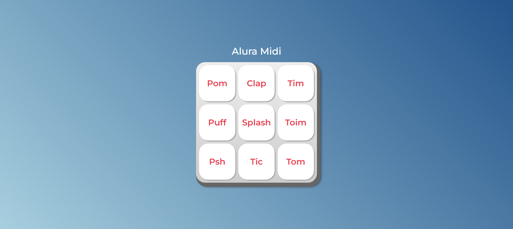

<h1 align="center">Alura MIDI</h1>

 

  
⚙️ O Alura MIDI é um instrumento musical de interface digitial (MIDI), que reproduz sons de instrumentos musicais, por enquanto de uma bateria, ao usuário clicar ou pressionar com teclado em seus botões. ⚙️

 

  

  
  

 

## 🔨 Funcionalidades do projeto

O MIDI tem um teclado digitial com 9 botões, cada botão reproduzirá o som de dado instrumento musical. O HTML carregará os arquivos de mídia com o som dos instrumentos através do elemento `<audio>`, e com o MIDI vamos controlar a reprodução destes arquivos de mídia através do clique em seus elementos `<button>`. Serão 9 sons diferentes.

## ✔️ Técnicas e tecnologias utilizadas

- `HTML`: O HTML tem um papel fundamental para a aplicação funcionar corretamente com a inserção dos elementos `<audio>` que irão prover para o JavaScript os controles de reprodução da mídia carregada. O HTML já virá pronto nos arquivos iniciais do curso;
- `CSS`: O CSS tem papel fundamental para indicar a interação do usuário com a interface gráfica, portanto indica quando os botões são pressionados por mouse ou teclado. O CSS já virá pronto nos arquivos iniciais do curso;
- `JavaScript`: O JavaScript proporcionará programarmos a dinâmica de controle de reprodução de um som, que a princípio está sendo realizada pelo elemento `<audio>`, e passarmos este controle para os elementos `<button>`, com todo o cuidado de fazer um código inteligente, sem repetição, que cuida também os aspectos visuais com CSS dinâmico. Abaixo alguns tópicos abordados no curso:
  - `querySelector`;
  - `document`;
  - `const`;
  - `function`;
  - `while`;
  - `for`;
  - `if`;
  - `else`;
  - `template string`;
  - `event handlers`;

 

## 🛠️ Abrir e rodar o projeto

Para abrir e rodar o projeto, basta abrir o aquivo `index.html` no navegador.

 

## 📝 License

  

Esse projeto está sob a licença MIT.

 

### 👨‍💻 Autor

 
 <em>Ciro Batista da Silva<em>
 
  

 
👋🏽 Entre em contato!

 

